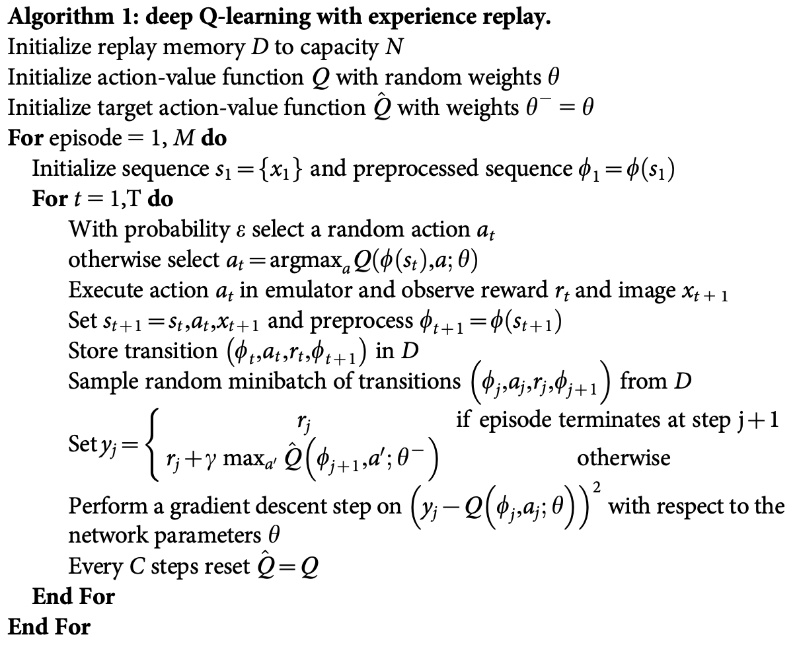

# Deep Q-Networks

The Tabular Q-learning methods can struggle with situations when the count of
the observable set of states is very large.

We can use a nonlinear representation that maps both the state and action onto
a value. This is called a "regression problem" in ML. Using a depp NN is one of
the most popular options, especially when dealing with observations represented
as screen images.

## Replay buffer

One of the fundamental requirements for SGD optimization is that the training
data is **independent and identically distributed** (i.i.d.). In our case
the data we will be using for the SGD update doesn't fulfill these criteria:
+ Our samples are not independent. They will belong to the same episode.
+ Distribution of our training data won't be identical to samples provided by the optimal policy that we want to learn. Data that we have will be a result of some other policy (e-greedy).

To overcome this we usually need to use a large buffer of our past experience and sample training data from it instead of using our latest experience. This technique is calle **replay buffer**. The simplest form of this is a buffer of fixed size with new data added at the end and pushes the oldest experience out of it.

Replay buffer allows us to train on more or less independant data but the data will be recent enough to train on samples generated by our recent policy.

## Correlation between steps

The Bellman equation provides us with the value of *Q(s,a)* via *Q(s',a')* (bootstrapping). However both state *s* and *s'* have only one step between them which makes them very similar. It is very hard for NNs to distinguish between them and when we make an update of our NN's parameters to make *Q(s,a)* closer to the desired result we can indirectly alter the value produced for *Q(s',a')* and other state nearby. This can make the training very unstable.

A *target network* is used to make our training more stable. We keep a copy of our network and use it for the *Q(s',a')* value in the Bellman equation. Periodically this network is synchronized with our main network.

## POMPDP (Partially Observable MDPs)

In the case of most Atari games for example a single frame of the game is not enough to capture all the important information and this violates the Markov property and move our single frame observation environment into the area of partially observable MDPs (POMDPs). The solution to this is maintaining several observations from the past and using them as a state. For example in the case of Atari games we usually stack *k* (*k* = 4 works well for most games) subsequent frames together and use them as the observation at every state.

## DQN algorithm

the algorithm for the paper published in *Nature (Human-Level Control Through Deep Reinforcement Learning)* has the following steps:

# DQN on Pong

## Wrappers

A set of wrappers from the OpenAI baselines are used to adress Atari platform features that make learning long and unstable. Those wrappers from OpenAI are applied to popular benchmark to establish the common ground for comparing methods.

The list of Atari transformations includes:
+ Converting individual lives in the game into separate episodes.
+ At the beginning of the game, performing a random amount of no-op actions.
-> ex. to skip intro screen.
+ Making an action decision every K steps, where K is usually 4 or 3.
-> Repeat the chosen action on intermediate frames.
+ Taking the maximum of every pixel in the last two frames and using it as an observation.
-> Counter the flickering effect on some Atari games.
+ Pressing **FIRE** at the beginning of the game.
-> Required to start some games.
+ Scaling every frame down to 84x84 single-color.
+ Stacking several (usually 4) subsequent frames together to give the network information about the dynamics of the game's objects.
+ Clipping the reard to -1, 0 and 1.
-> This normalize the rewards received in different games.
+ Convert the observation (image from the screen) into floats and rescale in the range \[0.0...1.0]

